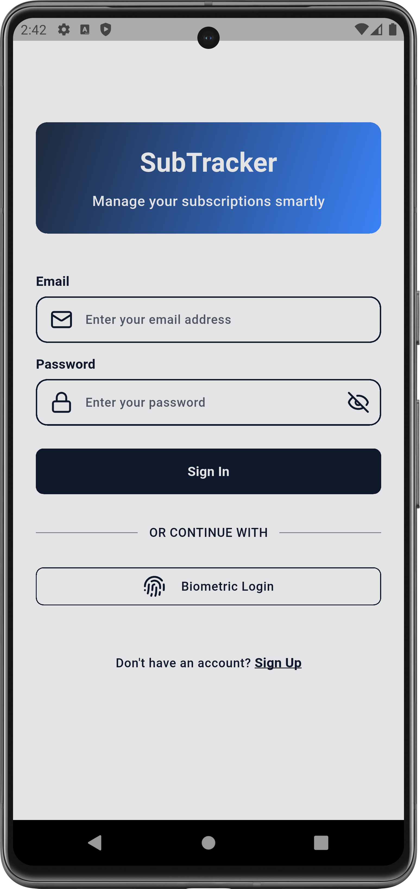
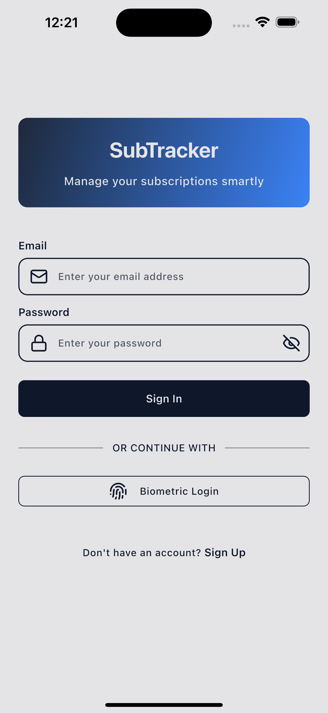
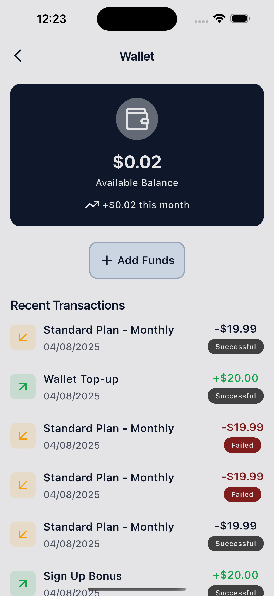
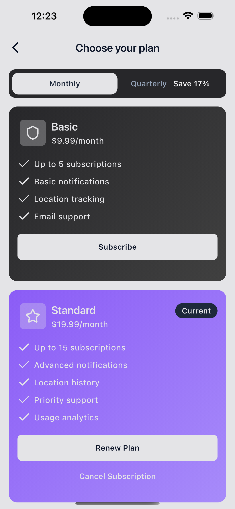
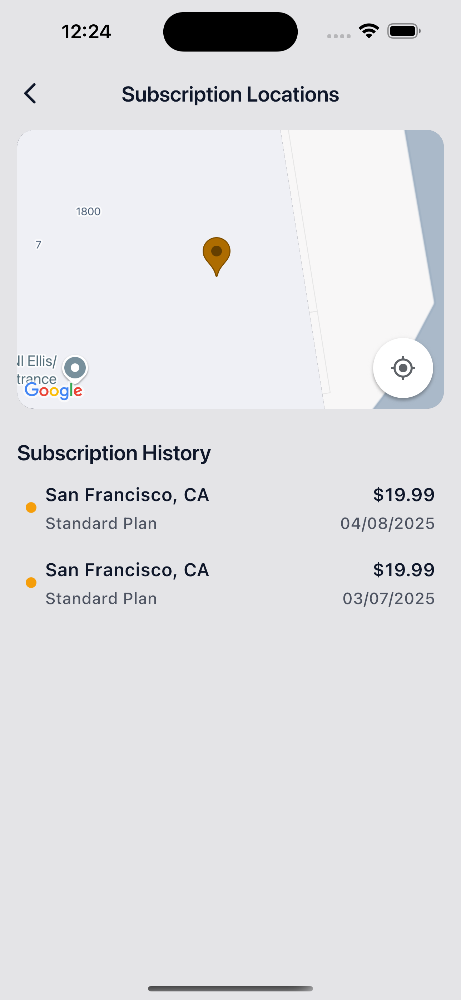
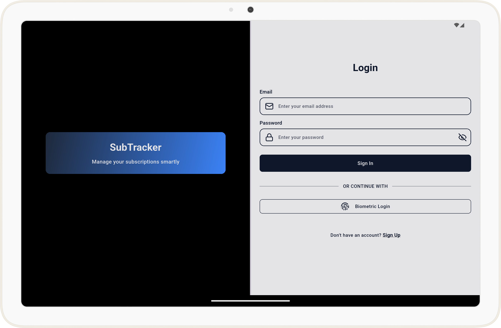
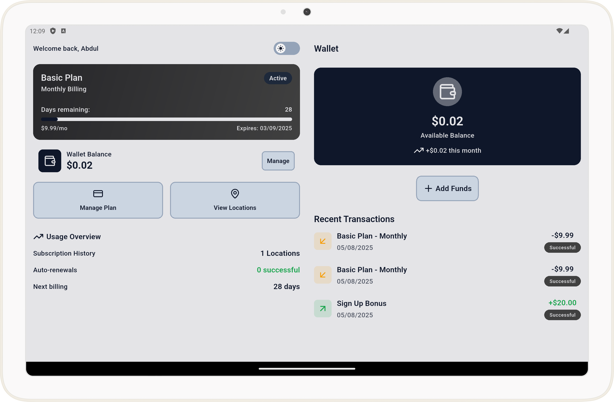
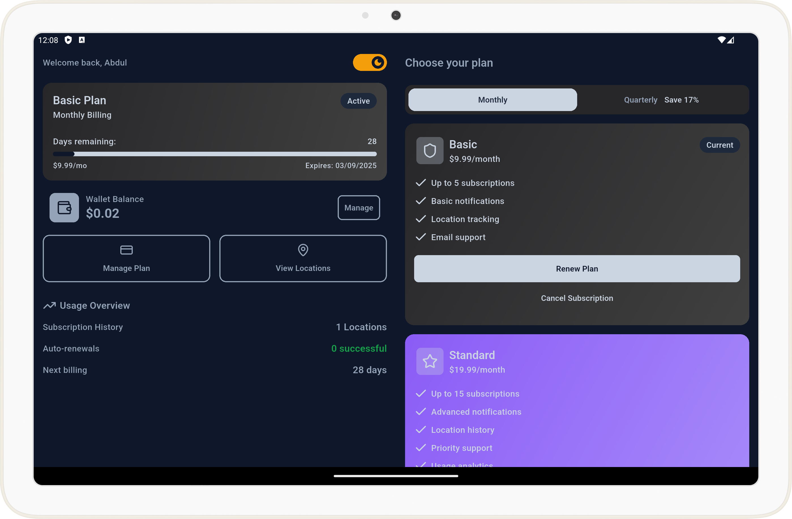

# 📱 Smart Subscription Tracker App

A Flutter application that simulates subscription management with authentication, biometric login, wallet billing, notifications, and location-based history — built using **Clean Architecture** and **feature-based structure**.

---

## 🚀 Features

### 🔐 Authentication
- Email/password login & registration
- Biometric login (Fingerprint/Face ID)
- Secure session persistence using `flutter_secure_storage`

### 📦 Subscription Management
- View current plan (Basic, Standard, Premium)
- Subscribe (monthly or quarterly billing)
- Cancel, upgrade, or downgrade
- Animated subscription cards showing pricing & benefits

### 🌍 Location Integration
- Save user’s location when subscribing
- Display subscription history on Google Maps
- Uses `geolocator` + `google_maps_flutter`

### 🔔 Notifications
- Local notifications with `flutter_local_notifications`
- Reminders 3 days before expiry
- Renewal failure alerts if balance is insufficient
- Tapping a notification navigates to relevant screen

### 💰 Wallet & Billing Simulation
- Wallet with an initial balance
- Auto-renewal deducts from wallet
- Renewal fails with notification if insufficient funds

### ⚙️ Background Processing
- Simulated with `workmanager`
- Periodic checks for expiring subscriptions
- Automatic renewal & wallet updates

### 🎨 UI/UX
- Smooth animations (Hero, AnimatedSwitcher, progress bars)
- Custom page transitions
- Adaptive layout (tablet & mobile)
- Dark mode toggle

> 💡 **Testing Notifications & Expiry**  
Toggling **Dark Mode** subtracts 1 day from the subscription dates to simulate time progression.

---

## 🏗️ Architecture

The project follows **Clean Architecture** with **feature-based modules**.

### 📂 Folder Structure

```
lib/
├── core/                      # Shared utilities & constants
│   ├── di/                    # Dependency injection (GetIt)
│   ├── theme/                 # App themes & dark mode
│   └── utils/                 # Helpers (formatters, extensions)
│
├── features/
│   ├── auth/                  # Authentication (login, signup, biometrics)
│   │   ├── data/              # Data sources, repositories implementaion
│   │   ├── domain/            # Models & repositories abstraction
│   │   └── presentation/      # UI & navigation
│   │
│   ├── dashboard/             # Main dashboard (wallet, active sub)
│   │   └── ...
│   │
│   ├── subscription/          # Plan selection, history, details
│   │   └── ...
│   │
│   └── wallet/                # Wallet balance & transactions
│       └── ...
│
└── main.dart                  # App entrypoint with GoRouter setup
```

---

## 📂 Key Dependencies

Some important dependencies powering this app:

- `flutter_bloc` → State management
- `hydrated_bloc` → Persistent state
- `go_router` → Declarative navigation
- `flutter_local_notifications` → Local notifications
- `google_maps_flutter` → Map integration
- `local_auth` → Biometric authentication
- `flutter_secure_storage` → Secure session storage
- `workmanager` → Background job simulation
- `objectbox` → Local database

---

## ⚙️ Setup & Installation

1. **Clone the repository**
```
git clone https://github.com/blackorbs-dev/sub_tracker.git
cd sub_tracker
```

2. **Get dependencies**
```
flutter pub get
```

3. **Run with Google Maps API key**
```
flutter run --dart-define MAPS_API_KEY="YOUR_GOOGLE_MAPS_API_KEY"
```

---

## 🔑 Testing Biometric Login
1. Ensure biometrics are enabled on your device/emulator.
2. On login, tap **Biometric Login**.
3. Authenticate with your saved fingerprint or Face ID.

---

## 🔔 Testing Notifications
1. Subscribe to a plan.
2. Toggle **Dark Mode** → simulates 1 day passing.
3. Notifications appear when subscription nears expiry or fails renewal.
4. Tap the notification to navigate back into the app.

---

## 🎥 Demo Video

[](https://drive.google.com/file/d/1nzIiTaicC4u0XVI2jHVMWd-_yrk2Qp-x/view?usp=sharing)

---

## 📸 Screenshots

### Mobile (iPhone 16 Simulator)
<div style="display: flex; overflow-x: auto; gap: 10px; padding: 10px;">
     
     
     
     
    
</div>

### Tablet (Pixel Emulator Api 34)
<div style="display: flex; overflow-x: auto; gap: 10px; padding: 10px;">
    
    
    
</div>
---

## 📜 Background Task Logs

Console logs show background simulation activity:

```
D/WM-WorkerWrapper(11267): Starting work for dev.fluttercommunity.workmanager.BackgroundWorker
D/WM-SystemJobService(11267): onStartJob for WorkGenerationalId(workSpecId=cc0fc086-6559-45ce-846e-ac5721596490, generation=0)
D/WM-Processor(11267): Work WorkGenerationalId(workSpecId=cc0fc086-6559-45ce-846e-ac5721596490, generation=0) is already enqueued for processing
D/WM-SystemJobScheduler(11267): Scheduling work ID cc0fc086-6559-45ce-846e-ac5721596490Job ID 7
D/WM-SystemJobService(11267): onStopJob for WorkGenerationalId(workSpecId=cc0fc086-6559-45ce-846e-ac5721596490, generation=0)
I/WM-WorkerWrapper(11267): Worker result SUCCESS for Work [ id=baad0a27-7746-4267-a9c6-723065cb3466, tags={ dev.fluttercommunity.workmanager.BackgroundWorker } ]
D/WM-Processor(11267): Processor baad0a27-7746-4267-a9c6-723065cb3466 executed; reschedule = false
D/WM-SystemJobService(11267): baad0a27-7746-4267-a9c6-723065cb3466 executed on JobScheduler
D/WM-GreedyScheduler(11267): Cancelling work ID baad0a27-7746-4267-a9c6-723065cb3466
```
